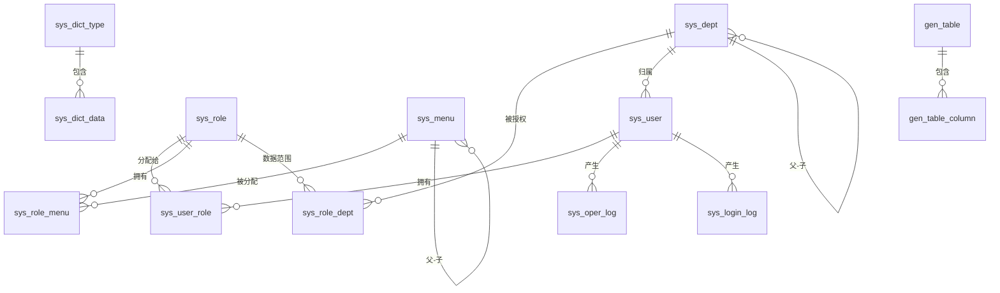

# 实体关系概览 (ER Overview)

## 表关系图 (Mermaid)

## 核心表一览

| 表名 | 角色 | 关键字段 |
|---|---|---|
| `sys_user` | 用户 | id, username, password, dept_id, status |
| `sys_role` | 角色 | id, code, data_scope |
| `sys_menu` | 菜单/按钮 | id, parent_id, menu_type, perm |
| `sys_dept` | 部门 | id, parent_id, ancestors |
| `sys_user_role` | 用户↔角色 | user_id, role_id |
| `sys_role_menu` | 角色↔菜单 | role_id, menu_id |
| `sys_role_dept` | 角色↔部门 (data_scope=5) | role_id, dept_id |
| `sys_oper_log` | 操作日志 (AOP) | title, business_type, oper_name |
| `sys_login_log` | 登录日志 | user_name, status, ip |
| `sys_dict_type` / `sys_dict_data` | 字典 | type / dict_type, label, value |
| `sys_config` | 系统参数 | config_key, config_value |
| `sys_notice` | 通知公告 | title, type, content |
| `sys_file` | 文件 | name, path, url, md5 |
| `sys_job` / `sys_job_log` | 定时任务 | bean_name, method_name, cron |
| `gen_table` / `gen_table_column` | 代码生成 | table_name / column_name |

## 关键设计点

### 1. 按钮级权限 (核心)

`sys_menu` 表的 `menu_type` 字段取值：
- `M` = 目录 (仅分组，无页面)
- `C` = 菜单 (有页面 + 路由)
- `F` = 按钮 (只有 `perm`，无页面)

`sys_menu.perm` 字段对应权限 key，例如 `system:user:add`，**同时**被：

1. **后端** `@PreAuthorize("hasAuthority('system:user:add')")` 校验
2. **JWT 声明** `perms[]` 携带，前端通过 `v-auth="'system:user:add'"` 指令控制显示

### 2. 数据权限 (5 级)

`sys_role.data_scope`:
- `1` = 全部
- `2` = 本部门
- `3` = 本部门及子部门
- `4` = 仅本人
- `5` = 自定义 (通过 `sys_role_dept` 配置)

可通过 MyBatis-Plus `InnerInterceptor` 在 SQL 拼接阶段自动注入 WHERE 条件。

### 3. 软删除

所有业务表都带 `del_flag SMALLINT DEFAULT 0`：
- `0` = 正常
- `1` = 已删除

MyBatis-Plus 配置 `logic-delete-field: del_flag`，所有 `DELETE` 自动转为 `UPDATE del_flag=1`，所有 `SELECT` 自动加上 `del_flag=0` 条件。

### 4. 审计字段

每张业务表都带 4 个审计字段：
- `create_by` / `create_time` — 创建人 + 时间 (创建时填)
- `update_by` / `update_time` — 最后修改人 + 时间 (创建+更新时填)

由 `MetaObjectHandler` 自动填充，从 `SecurityContext` 取当前用户名。

### 5. 菜单路径

前端路由通过 `component` 字段映射到 `src/views/{component}.vue`：

| 数据库 `component` | 对应前端文件 |
|---|---|
| `system/user/index` | `src/views/system/user/index.vue` |
| `monitor/operlog/index` | `src/views/monitor/operlog/index.vue` |
| `tool/gen/index` | `src/views/tool/gen/index.vue` |

权限菜单在 `permission.ts` 中通过 `import.meta.glob('@/views/**/*.vue')` 自动匹配加载。

## 索引速查

| 表 | 索引 | 用途 |
|---|---|---|
| `sys_user` | idx_user_dept | 按部门筛选用户 |
| `sys_menu` | idx_menu_parent | 按父 ID 取子菜单 |
| `sys_oper_log` | idx_oper_user, idx_oper_time | 按用户/时间查操作日志 |
| `sys_login_log` | idx_login_user_time | 按用户+时间组合查 |
| `sys_dict_data` | idx_dict_type | 按类型取字典 |
| `gen_table_column` | idx_gen_table_id | 按表 ID 联表查询 |